# 📱 Mobile Battery Life Prediction

**Machine Learning Mini Project**  
**Student Name:** Prapti Gaikwad  
**Branch:** Artificial Intelligence and Data Science (AI/DS)  
**Academic Year:** 3rd Year  

---

## 📌 Project Overview
Smartphone battery life estimation is crucial for user experience and device power optimization. Traditional battery percentage indicators only display remaining charge level without accounting for the dynamic discharge rate caused by active workloads, screen brightness, network mode (5G vs Wi-Fi), and thermal or hardware aging.

This project implements an end-to-end Machine Learning system that predicts the **exact remaining battery duration (in hours)** based on live phone telemetry, hardware specifications, and battery degradation parameters.

---

## 🎯 Project Objectives
1. Collect and preprocess smartphone telemetry and hardware degradation data.
2. Perform Exploratory Data Analysis (EDA) to understand feature distributions and physical discharge trends.
3. Handle missing values and scale/encode features via an automated Scikit-Learn `Pipeline`.
4. Train and compare 3 regression algorithms:
   - **Linear Regression** (Baseline parametric model)
   - **Decision Tree Regressor** (Non-linear tree partitioning)
   - **Random Forest Regressor** (Ensemble bagging model)
5. Evaluate models objectively using **MAE, MSE, RMSE, and $R^2$ Score**.
6. **Dynamically select the best model** (no hardcoding) and persist it with `joblib`.
7. Provide an interactive **Streamlit web application** (`app.py`) for live user inference.

---

## 🗂️ Project Folder Structure
```text
Mobile_Battery_Life_Prediction/
│
├── dataset/
│   └── mobile_battery_data.csv        # Dataset with 3,000 smartphone records
│
├── notebooks/
│   └── analysis.ipynb                 # Complete executed Jupyter Notebook
│
├── models/
│   ├── battery_life_model.pkl         # Serialized Scikit-Learn pipeline (Best Model)
│   └── model_metadata.json            # Model evaluation metrics and training metadata
│
├── screenshots/                       # Generated EDA and evaluation plots
│   ├── battery_life_distribution.png
│   ├── correlation_heatmap.png
│   ├── battery_pct_vs_remaining_life.png
│   ├── feature_importance.png
│   └── model_comparison.png
│
├── app.py                             # Interactive Streamlit Web Application
├── train_model.py                     # ML pipeline training and dynamic selection script
├── generate_dataset.py                # Dataset creation script with physical battery dynamics
├── create_notebook.py                 # Notebook generation script
├── requirements.txt                   # Project Python dependencies
└── README.md                          # Project documentation and viva guide
```

---

## 📊 Dataset Features & Specifications

The dataset contains **3,000 samples** representing realistic smartphone battery discharge dynamics:

| Feature Name | Description | Units / Type |
|---|---|---|
| `Battery_Capacity_mAh` | Total manufacturer battery capacity | 3000 to 6000 mAh |
| `Current_Battery_Pct` | Current battery charge percentage | 5% to 100% |
| `Screen_On_Time_Hours` | Screen active duration today | 0.5 to 11.5 hours |
| `CPU_Usage_Pct` | Average active processor utilization | 10% to 95% |
| `RAM_Usage_Pct` | Random Access Memory usage | 20% to 95% |
| `Mobile_Data_Usage_GB`| Cellular data consumed | 0.0 to 12.0 GB |
| `WiFi_Usage_Hours` | Connection time to Wi-Fi | 0.0 to 12.0 hours |
| `Number_of_Apps_Running`| Background and foreground active apps | 2 to 35 apps |
| `Brightness_Level_Pct`| Display backlight brightness | 10% to 100% |
| `Gaming_Hours` | Time spent on intensive mobile gaming | 0.0 to 6.0 hours |
| `Charging_Cycles` | Total lifetime charge/discharge cycles | 10 to 1500 cycles |
| `Device_Age_Months` | Age of device since unboxing | 1 to 48 months |
| `Temperature_C` | Operating battery temperature | 25.0°C to 48.5°C |
| `Network_Usage` | Active network mode | Categorical ('Wi-Fi', '4G', '5G') |
| `Battery_Health_Pct` | Maximum capacity degradation state | 70% to 100% |
| **`Battery_Life_Remaining_Hours`** | **Target Variable: Expected remaining hours** | **0.4 to 16.0 hours** |

---

## ⚙️ Machine Learning Pipeline

```mermaid
flowchart LR
    A["Raw Dataset (CSV)"] --> B["Data Cleaning & Median Imputation"]
    B --> C["EDA & Visualization"]
    C --> D["Train-Test Split (80/20)"]
    D --> E["ColumnTransformer Preprocessing"]
    E --> F["Train 3 Regression Models"]
    F --> G["Evaluate MAE, MSE, RMSE, R²"]
    G --> H["Dynamic Best Model Selection"]
    H --> I["Joblib Export (battery_life_model.pkl)"]
    I --> J["Streamlit Web UI (app.py)"]
```



### Preprocessing Architecture
- **Missing Values:** Handled via `SimpleImputer(strategy='median')` to guard against outliers.
- **Continuous Numerical Features:** Standardized using `StandardScaler` ($z = \frac{x - \mu}{\sigma}$).
- **Categorical Feature (`Network_Usage`):** One-hot encoded using `OneHotEncoder(drop='first', handle_unknown='ignore')`.
- All steps bundled in a Scikit-Learn `Pipeline` to eliminate data leakage.

---

## 🏆 Model Evaluation & Results

Evaluation on unseen test set (20% split, 600 samples):

| Regression Algorithm | MAE (hours) | MSE ($hours^2$) | RMSE (hours) | $R^2$ Score | Selection Status |
|---|---|---|---|---|---|
| **Linear Regression** | 0.5670 | 0.6395 | 0.7997 | 0.9099 | Baseline |
| **Decision Tree Regressor** | 0.7262 | 0.9443 | 0.9717 | 0.8669 | Candidate |
| **Random Forest Regressor** | **0.4648** | **0.4016** | **0.6337** | **0.9434** | 🏆 **Best Model (Selected)** |

> **Automated Dynamic Selection:**  
> The script automatically identifies and saves the top-performing model via programmatic evaluation (`results_df['R2_Score'].idxmax()`), guaranteeing zero hardcoding.

---

## 🚀 How to Run the Project

### 1. Prerequisites
Ensure Python 3.9+ is installed on your system.

### 2. Clone or Open Project Directory
```bash
cd "Mobile_Battery_Life_Prediction"
```

### 3. Install Required Dependencies
```bash
pip install -r requirements.txt
```

### 4. (Optional) Re-generate Dataset & Train Model
```bash
python generate_dataset.py
python train_model.py
```

### 5. Launch the Streamlit Web Interface
```bash
streamlit run app.py
```
The browser will automatically open at `http://localhost:8501`.

---

## 🌐 Streamlit User Interface Features
The application provides:
1. **Interactive Prediction Form:** Sliders and number inputs for all 15 device parameters.
2. **Quick Demo Presets:** Pre-configured test cases (*Balanced User*, *Mobile Gamer*, *Power-Saving Travel*, *Degraded Older Phone*) for instant viva demonstration.
3. **Target Explanation Display:**
   > *"The predicted remaining battery life is approximately **X hours**."*
4. **Visual Battery Progress Indicator:** Color-coded charge status and discharge speed assessment.
5. **Model Evaluation & EDA Tab:** Interactive tables, correlation matrix, target distribution, and feature importance chart.
6. **Smart Battery Optimization Tips:** Dynamic recommendations to extend battery lifespan.
7. **Viva Q&A Guide Tab:** Built-in interview preparation directly inside the application.

---

## 🎓 Viva Questions & Answers (For Oral Exam Preparation)

### Q1. Why did you choose Mobile Battery Life Prediction as your mini project?
**Answer:** Most smartphones only tell users the remaining battery percentage (e.g., 50%), which does not reflect how long the device will actually last under different usage patterns. Predicting the remaining battery life in hours gives actionable insights, helps manage critical tasks, and enables intelligent device power management.

### Q2. Why is Random Forest Regressor better than Linear Regression here?
**Answer:** Battery discharge rate is non-linear and governed by multivariate physical and thermal interactions. For instance, high CPU usage combined with 5G and high brightness causes exponential thermal throttling and current leakage. Linear regression assumes additive linear relationships, whereas Random Forest utilizes an ensemble of decorrelated decision trees that effectively model non-linear boundaries and feature interactions without overfitting.

### Q3. What is the difference between MAE, MSE, and RMSE?
**Answer:**
- **MAE (Mean Absolute Error):** The average absolute difference between predicted and actual remaining hours. Less sensitive to large outliers.
- **MSE (Mean Squared Error):** The average of squared errors; penalizes large prediction errors more severely.
- **RMSE (Root Mean Squared Error):** The square root of MSE. It brings the error metric back to the original unit (hours), making it intuitive to interpret.

### Q4. What does an $R^2$ Score of 0.9434 mean?
**Answer:** An $R^2$ (Coefficient of Determination) of 0.9434 means that approximately 94.34% of the total variance in the remaining battery hours is successfully explained by our selected features.

### Q5. How does your pipeline prevent data leakage?
**Answer:** We perform `train_test_split` before fitting any transformers. The `StandardScaler` and `SimpleImputer` are fitted strictly on `X_train` and only applied via `.transform()` to `X_test`. Both transformers and the regressor are encapsulated inside a Scikit-Learn `Pipeline`.

---

## 👩‍💻 Student Information
- **Name:** Prapti Gaikwad
- **Degree:** Bachelor of Technology / Engineering
- **Department:** Artificial Intelligence and Data Science (AI/DS)
- **Year:** 3rd Year
- **Project Type:** Machine Learning Mini Project
